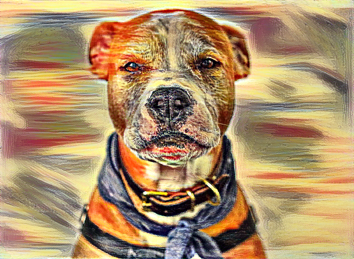

# Style Transfer : Learn and Play

This repository contain learning material for style transfer algorithms, and implementation ready to use
so you can play with it without prior knowledge on ML or either programming.

Use it for generating images, and then dig the code if you are curious.

# Setup
The code is in [this jupyter notebook](./Pytorch_Style_Transfer.ipynb).

Go to [Gloogle Colab](https://colab.research.google.com/). Once registered, open the notebook from this git repository (you just have to go to the github dongle and copy and past the url of this repo).

Open the execution environment menu and select GPU if it's not already the case (GPU makes it run faster).

You can then execute the notebook as if. Change the values of `content_url` and `style_url` to either a predefined image, or the url of an image of your choice to try with other images.

# Credits
This code is inspired from the [pytorch tutorial](https://pytorch.org/tutorials/advanced/neural_style_tutorial.html),
and the tensorflow implementation of [Greg surma](https://github.com/gsurma/style_transfer).
Thanks to the original style transfer paper from [Gatys and al.](https://zpascal.net/cvpr2016/Gatys_Image_Style_Transfer_CVPR_2016_paper.pdf)